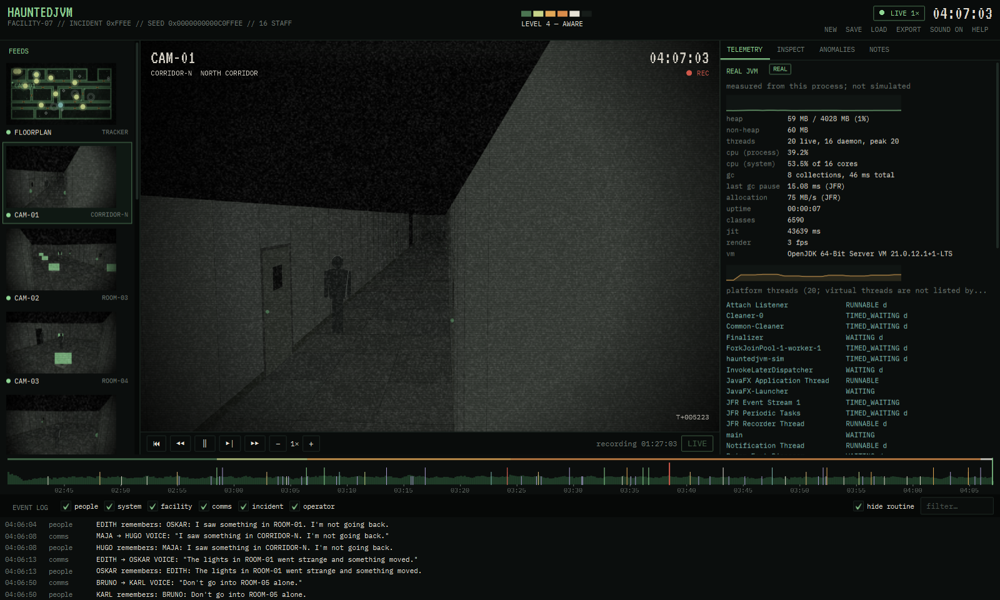
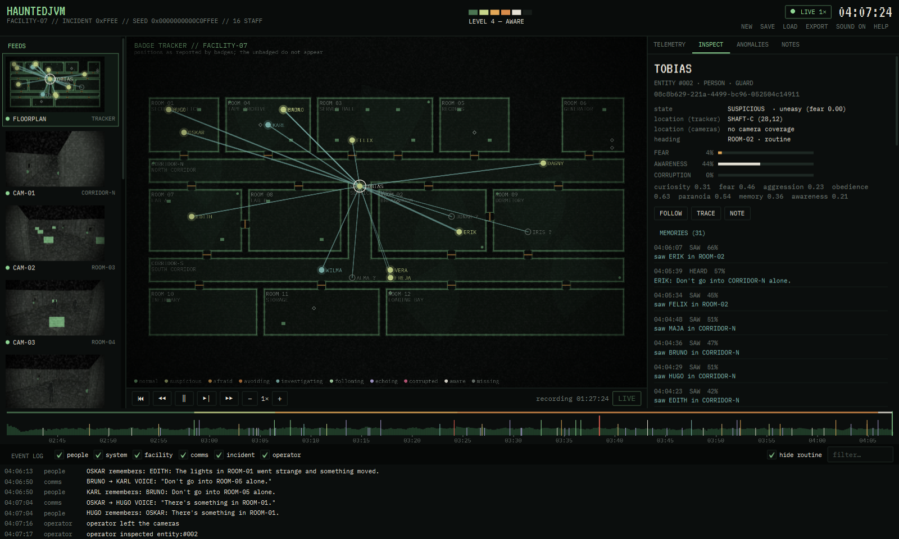
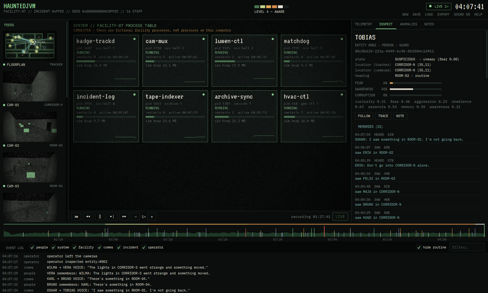
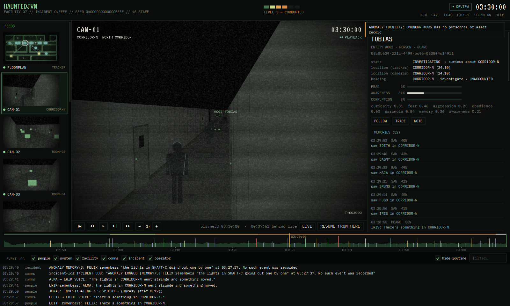
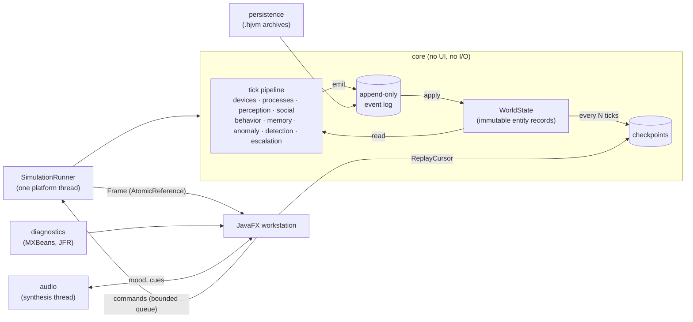

# HAUNTEDJVM

**An emergent JVM horror simulation.**

You are the night operator at FACILITY-07. You have eight camera feeds, a badge tracker, the
facility's process table, and a recording of everything that has happened tonight. The night
shift is going about its routine. Your job is to watch, and to write down anything that does not
make sense.

Nothing that happens is scripted. There is no timeline of scares. A deterministic simulation of
people, processes and rooms runs underneath, an anomaly engine interferes with it, and what you
see is whatever that interference and those people's reactions to it happen to produce. The same
seed gives the same night; a different seed gives a different one; and what you do (where you
look, which lights you turn off, which process you kill, whether you rewind) changes it.



| | |
|---|---|
|  |  |
| The badge tracker shows where badges are. The cameras show what is there. | Fictional facility processes. Kill `cam-mux` and every feed fills with static. |



## Quick start

Requires a JDK 21 or newer. Everything else is downloaded by the Gradle wrapper.

```bash
git clone https://github.com/711nishtha/hauntedjvm.git
cd hauntedjvm
./gradlew run
```

Or pick the night:

```bash
./gradlew run --args="--seed archive"            # any word works as a seed
./gradlew run --args="--seed 0xC0FFEE --entities 24 --simulation-speed 2"
```

Or run it without a window and read the incident log:

```bash
./gradlew installDist
./app/build/install/hauntedjvm/bin/hauntedjvm --headless --seed archive --ticks 12000
```

```
03:32:39  TERMINAL: "WHO IS WATCHING CAM-01" (no sender)
03:45:00  INCIDENT LEVEL 1 (ODD)
03:47:20  [SYSTEM/3] pid 2200 (hvac-ctl) terminated at 03:47:13 and is still allocating
03:50:10  [MEMORY/3] DAGNY remembers "ROOM-12, but the room was longer than it should be" at 03:46:30. No such event was recorded
...
log digest      3d5a870b0b5303d08ce732e0997ac6708e1eca18f622a05e229b6c24856c9ddc
```

The digest is a SHA-256 of the whole event log. Run it again, on any machine, and you get the
same one. CI checks exactly that on Linux, Windows and macOS.

| Flag | |
|---|---|
| `--seed <value>` | decimal, `0x` hex, or any word |
| `--entities <n>` | night-shift headcount, 1 to 4000 (default 16) |
| `--simulation-speed <x>` | playback multiplier, 0.25 to 64 |
| `--load <file.hjvm>` | open a saved investigation |
| `--mute` | start with sound off |
| `--debug` | verbose logs, and the anomaly engine's own hidden events in the log |
| `--headless` | no window; with `--ticks`, `--save`, `--report` |

Press **F1** in the application for the controls. The ones you need first: **Space** pauses,
**← →** scrub the recording, **1 to 8** switch cameras, **F** is the floor plan, **click** anyone to
inspect them, **N** writes a note, **R** while reviewing rewinds the night to the playhead.

## Features

- **A real simulation.** Staff with personalities, fear, awareness, memories and relationships;
  routines weighted by how much they dread each room; conversations that spread worries as
  hearsay; collective forgetting. Doors, lights, cameras and fictional processes with
  consequences (the badge tracker, the camera multiplexer and the lighting controller are
  processes you can kill).
- **Emergent anomalies.** A procedural director applies seeded perturbations whose preconditions
  depend on the state of the night; an independent detector reports the inconsistencies that
  result. Escalation from `LEVEL 0 NORMAL` to `LEVEL 5 CRITICAL` is earned, not scheduled, and
  many nights never get there.
- **Time travel.** Pause, scrub, play back at any speed, jump to any event, and rewind the live
  night to any earlier point. Rewinding forks the timeline. Some minds notice.
- **Investigation tools.** Inspector for people, events, anomalies, processes, doors, rooms and
  real JVM threads, all cross-linked; relationship tracing; notes attached to anything; a
  timeline strip showing event density, anomalies, escalation and rewinds.
- **Three kinds of telemetry, never mixed.** REAL JVM (MXBeans and JFR), SIMULATION (the model)
  and INCIDENT (the fiction), each labelled as what it is.
- **Sessions.** Save, load and export. Loading replays the log from scratch and verifies it.
- **Procedural audio.** Mains hum, room tone, a drone that beats faster as tension rises. No
  recorded sound is bundled.

## Architecture



| Module | Responsibility | Depends on |
|---|---|---|
| `core` | World, entities, events, behaviour, memory, anomalies, timeline, replay | nothing |
| `persistence` | Session archives, incident reports, JSON format | core, Jackson |
| `diagnostics` | Real JVM telemetry | JDK only |
| `audio` | Procedural synthesis | JDK only |
| `app` | Runner, CLI, headless mode, JavaFX workstation, renderers | all of the above, JavaFX |
| `benchmark` | JMH suites | core, persistence |

The core has no dependency at all, not even on a logging API, and no serialisation
annotations. It is tested entirely without a display.

## Simulation model

The facility is a 64 × 33 grid read from a plain-text floor plan
([`facility-07.map`](core/src/main/resources/hauntedjvm/world/facility-07.map)): twelve rooms,
three corridors, twenty-odd doors, and one more room behind a sealed door that is not on any list.

Everything is an entity: persons, processes, doors and terminals, rooms, cameras, objects, the
facility controller. An `Entity` is an immutable record with a sealed `Facet` for its kind: a
`Mind` for people, a `ProcessFacet` for processes, and so on. The world state holds them in a
`TreeMap` and replaces a record whenever something happens to it.

**One tick is one second of facility time.** Each tick runs a fixed pipeline of systems:

1. **Devices and processes.** Doors close, temporary lighting reverts, processes allocate and die,
   and the watchdog restarts them (unless they still look alive).
2. **Perception.** People notice who else is in the room, whether objects have moved, whether it
   is dark, whether they are alone.
3. **Conversation.** People who share a room talk. If one of them is carrying a frightening
   memory, that is what they talk about.
4. **Behaviour.** Each mind picks a state (`NORMAL`, `SUSPICIOUS`, `AFRAID`, `INVESTIGATING`,
   `AVOIDING`, `FOLLOWING`, `ECHOING`, `CORRUPTED`, `AWARE`) from its traits, affect, memories
   and company, with hysteresis, then plans a goal and takes a step along a cached flow field.
5. **Memory.** Faint memories fade. Anyone no present mind remembers becomes *forgotten*.
6. **The anomaly engine, detection, escalation.** See below.

Personality is seven traits (curiosity, fear, aggression, obedience, paranoia, memory strength,
awareness), and they matter. A frightened paranoid person avoids; a frightened trusting one runs
to someone. Obedient people follow calmer colleagues they trust, and so inherit whatever those
colleagues are avoiding. Nothing in the behaviour code mentions a specific room: when someone
stops going into the tape archive, it is because of something they remember.

## Event system

Systems never change state. They decide, and they `emit` an event. `WorldState.apply` is the
only mutator, and it is a switch over a sealed hierarchy:

```java
sealed interface SimEvent permits EntityEvent, ProcessEvent, EnvironmentEvent,
                                  CommunicationEvent, AnomalyEvent, OperatorEvent { ... }

switch (record.event()) {
    case EntityEvent e        -> entity(record, e);
    case ProcessEvent e       -> process(record, e);
    ...
}
```

Every nested switch is exhaustive, so adding an event type without teaching replay what it means
does not compile. The same sealed hierarchy drives serialisation: the persistence module walks
`getPermittedSubclasses()` to register Jackson subtypes, and a test fails if any event type lacks
a round-trip sample.

The operator is in the log too. Switching cameras, inspecting someone, locking a door, pausing
and rewinding are all events. That is what makes a session with interventions replay exactly,
and it is also why the simulation can react to where you are looking.

The event log is append-only with one writer and many lock-free readers: records live in chunks
that never move, and the size is published with a volatile write after the record is in place.
The renderer, the timeline strip, the inspector and the save code all read it while the
simulation keeps writing.

## Determinism

The same seed and the same operator input produce the same log, bit for bit, on any JVM.

- **Counter-based randomness.** There is no long-lived random generator. Every decision asks for
  `Rng.stream(seed, tick, purpose, subject)`, a SplitMix64 stream keyed by where the decision
  is made. A world restored from a checkpoint continues identically without saving RNG state, and
  adding a new system does not shift anyone else's random numbers. Derived draws (`nextDouble`,
  bounded ints) are implemented locally rather than inherited from `RandomGenerator`, whose
  default algorithms the JDK is free to change.
- **Defined iteration order.** Tree maps and sorted sets wherever a decision iterates.
- **Stateless systems.** Anything that affects a future decision lives in world state. Decaying
  values like fear are stored as (level, time of last change) and evaluated lazily, so they
  need no per-tick events. `DeterminismTest` resumes an engine from its own timeline mid-run to
  prove nothing is hidden elsewhere.
- **One thread.** All entities are processed in serial order on one thread. A thread per
  entity (virtual or not) would make the order of decisions depend on the scheduler, and a tick
  for a normal night shift takes about 0.2 ms anyway.

## Replay

```
checkpoint (≤ target) + events recorded after it, up to the target tick = the world at that tick
```

Checkpoints are taken every 100 ticks. Because entities are immutable records, a checkpoint
shares every unchanged entity with the one before it; the cost is roughly an array of references.
Reconstruction starts after the checkpoint's last sequence number rather than its tick, because
operator commands issued while paused are appended to a tick after its checkpoint was taken.

- **Scrubbing** uses a `ReplayCursor`: moving forward applies only the events crossed; jumping
  back restores a checkpoint. Playback costs microseconds per tick.
- **Rewinding** does not edit the log. It creates a new timeline containing the prefix, so
  anything still drawing the old one keeps working, then records a `TimelineRewound` event.
  People who were aware enough at the moment you rewound may carry a few memories of the future
  you just discarded, and the detector notices memories dated after "now".
- **Loading a session** rebuilds every checkpoint from an empty world and the log alone, checks
  the log's SHA-256 digest, and verifies the stored checkpoints against the replay. A tampered or
  damaged file is refused. (The first version of this check was fooled by a single edited
  movement, because the next move overwrote the damage before any checkpoint saw it; the applier
  now also rejects moves that do not start where the entity is.)
- **Looping cameras** use the same machinery: a feed stuck in the past is rendered from a
  `ReplayCursor` a few minutes behind. The clock in the corner is the tell.

The central property is tested with jqwik for arbitrary seeds, ticks and checkpoint intervals:
reconstruction equals the live world, exactly.

## Anomaly engine

Two independent halves.

**The director** (`AnomalySystem`) may intervene at most once per cooldown. The chance grows with
*instability*, a saturating function of active anomalies, fear, awareness, corruption, missing
people and rewinds. Each perturbation declares a minimum escalation level and a weight that is
zero unless the world supports it: a zombie process needs a process; an object only moves in a
room nobody is in and you are not watching; a disappearance needs someone alone and unobserved.
Some perturbations schedule follow-ups, which live in world state so chains survive
checkpoints. Categories: temporal, spatial, behavioural, memory, system, visual, communication,
identity and observation.

**The detector** (`AnomalyDetector`) knows nothing about the director. It checks invariants a
sane facility would satisfy: records are dated when they were written, memories point at events
that say what the memory says, one badge per person, dead processes stay dead. Then it reports
violations. Some are caused by the director. Some come from rumours: a paranoid person retelling
a story puts it in the wrong room, and the detector cannot tell that apart from interference.
Neither, at first, can you.

The unaccounted entity is not scripted either. It prefers the dark, rooms nobody is watching,
and people who are alone. It only moves when you are not looking at it. It can take the place of
someone *nobody remembers*, which is a condition the memory system produces on its own, and after
that their badge keeps walking the floor plan. Held in the light on your screen long enough, it
retreats behind the wall that is not on the plan.

There are also a few rare events. They are seeded, gated on escalation, and happen at most once
per night. They are not documented here.

## JVM telemetry

The right-hand panel has three sections, and they never borrow from each other.

| Section | Source | Contents |
|---|---|---|
| **REAL JVM** | `ManagementFactory` MXBeans, an in-process JFR `RecordingStream` | heap, non-heap, threads, process and system CPU, GC counts and time, GC pause durations (JFR), allocation rate (JFR), uptime, classes, JIT, render FPS, the actual platform thread list |
| **SIMULATION** | `SimulationMetrics.of(world)` | tick, speed, tick cost, entity counts, states, corruption, missing, mean fear and awareness, events, checkpoints, timeline divergence |
| **INCIDENT** | the same world state, presented as the fiction | level, instability breakdown, "severity: UNKNOWN", orphaned references, badges without wearers |

JFR is used for the two figures MXBeans cannot provide: individual GC pause durations and
allocation rate. The stream is kept in memory with a short max age and never written to disk.
Sampling runs on a virtual thread, since it does nothing but read a few beans once a second.
The process table in the SYSTEM view is labelled as simulated: those are fictional facility
processes, not processes on your computer.

## Concurrency

| Thread | What it does | Why this kind |
|---|---|---|
| `hauntedjvm-sim` (platform) | owns the engine; fixed-step pacing with bounded catch-up | determinism needs one owner; pacing needs a thread that sleeps predictably |
| JavaFX application thread | renders at display rate, interpolating between ticks | JavaFX rule |
| `audio-synth` (platform, max priority) | synthesises and writes to the sound line | `SourceDataLine.write` blocks in native code and would pin a virtual thread's carrier |
| `jvm-telemetry` (virtual) | samples MXBeans | tiny, periodic, blocking-free |
| save/load/export (virtual, per task) | zip I/O, replay verification | I/O-bound, short-lived, never on the UI thread |
| JFR stream (JDK-managed) | GC and allocation events | |

The UI and the simulation share no locks. The runner publishes an immutable `Frame` (a world
snapshot plus the timeline and a consistent event count) through an `AtomicReference`, and
receives commands through a bounded `ArrayBlockingQueue`. If the queue is full, the command is
refused immediately and the operator sees it; nothing blocks the UI thread. Checkpoints live in a
`ConcurrentSkipListMap`, the one standard collection that offers both concurrent reads during
writes and an ordered `floorEntry`.

## Performance

Measured with `./gradlew benchmark` (JMH, 3 × 2 s iterations, one fork) on a 16-core Windows
laptop, Temurin 21. Short runs; treat them as indicative.

| Benchmark | Result |
|---|---|
| Simulation ticks per second, 16 staff | ~4,700 |
| Simulation ticks per second, 64 staff | ~1,800 |
| Simulation ticks per second, 256 staff | ~450 |
| Simulation ticks per second, 1,024 staff | ~65 (was 18 before the perception change below) |
| Replay: one playback step | 2.6 µs |
| Replay: jump to a random tick (checkpoint + events) | 140 µs |
| Replay: rebuild a 6,000-tick timeline from its log | ~38 ms |
| Event serialization, write / read | ~1.6 M / ~1.1 M records per second |

At the default 16 staff a tick costs about 0.2 ms. Real time at 1× is 5 ticks per second, so the
simulation has roughly three orders of magnitude of headroom, and 64× playback is cheap.

Two optimisations were made after measuring. Perception was quadratic in crowded rooms, so pairs
are now bucketed by the residue class of their noticing schedule, and a crowded observer
registers at most one new face per tick. At the default headcount the resulting logs are
byte-identical to before. In the UI, the staff roster and the inspector's activity list were
rebuilding nodes and rescanning the log several times a second, which caused visible hitches;
both are now incremental. The workstation renders at about 40 FPS in a 1600 × 960 window, and
the simulation runs on its own thread, so rendering speed never affects it.

## Testing

```bash
./gradlew test    # 110+ tests plus property-based runs; about a minute
./gradlew check   # tests + Checkstyle + -Werror compilation
```

- **Determinism:** same seed gives the same digest; resuming mid-run changes nothing; operator
  input replays; rewind branches are themselves deterministic.
- **Replay (jqwik properties):** reconstruction equals the live world for arbitrary seeds, ticks
  and checkpoint intervals, including commands issued between ticks; a timeline rebuilt from the
  log alone reconstructs every tick; tampered checkpoints are caught.
- **Behaviour:** a frightening memory keeps someone out of a room; fear becomes flight or
  avoidance depending on paranoia; followers attach to calmer trusted colleagues.
- **Anomalies:** each detector invariant; variety across seeds; no interventions in the grace
  period; banishing the figure by holding it on camera.
- **Persistence:** every event type round-trips (enforced against the sealed hierarchy); a loaded
  session continues exactly as the original would; tampered logs are refused.
- **Runtime:** runner pausing, stepping, commands, rewind and consistent capture; CLI parsing;
  headless reproducibility.
- **Audio:** the synth renders offline and is checked for clipping, transience and determinism.

`./gradlew :app:screenshots` re-renders the images above from a seeded night.

## Design decisions

- **Java 21, no framework.** Records, sealed interfaces and pattern matching carry most of the
  design; virtual threads handle the I/O. There is no dependency-injection container because
  there is nothing to inject that a constructor cannot.
- **Event sourcing over snapshots-only.** Replay, rewind, save files, the detector's evidence
  links and the incident report all fall out of one log.
- **Immutable entities in a mutable map.** Cheap structural sharing for checkpoints and frames
  without a persistent-collections library.
- **A plain-text floor plan.** Easy to read, diff and edit; the parser is a hundred lines.
- **Flow fields, not A\*.** Destinations are room anchors, so a few dozen cached distance fields
  serve every walker.
- **Hand-rolled CLI.** Six flags do not justify a dependency.
- **2.5D on a Canvas, not 3D.** A pinhole projection with near-plane clipping and painter's
  ordering is enough for rectangular rooms, and leaves room for the part that matters: grain,
  infrared, interference, and a clock that is sometimes wrong.
- **An honest haunting.** The application never reads your files, never opens a microphone or
  camera, and never touches the network. See [SECURITY.md](SECURITY.md).

## Contributing

See [CONTRIBUTING.md](CONTRIBUTING.md). The short version: state changes only through events,
systems stay stateless, randomness comes from `ctx.rng`, and anomalies change state rather than
pixels.

## License

MIT, see [LICENSE](LICENSE). Bundled fonts are under the SIL Open Font License; see
[THIRD_PARTY_NOTICES.md](THIRD_PARTY_NOTICES.md).
